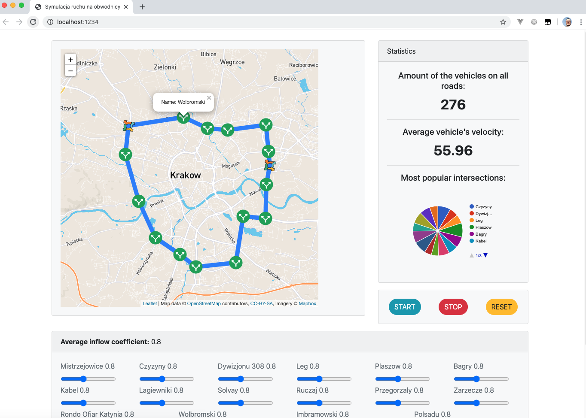

# SDSZ-Obwodnica

docs: https://github.com/KalitaKonrad/SDSZ-Obwodnica-lll/blob/docs/docs/Symulacja_ruchu_drogowego.pdf

## Plan projektu:

- [x] Sformułowanie problemu.
- [x] Analiza dostępnych rozwiązań.
- [x] Budowa algorytmu i modelu matematycznego.
- [x] Implementacja w języku JavaScript.
- [x] Implementacja animacji.
- [ ] Analiza i ocena poprawności wyników.



## Project setup

```
npm install
```

### Run unit tests

```
npm run test
```

### Compiles and hot-reloads for development

```
npm run serve

Server runs on localhost:1234
```

### Compiles and minifies for production

```
npm run build
```
